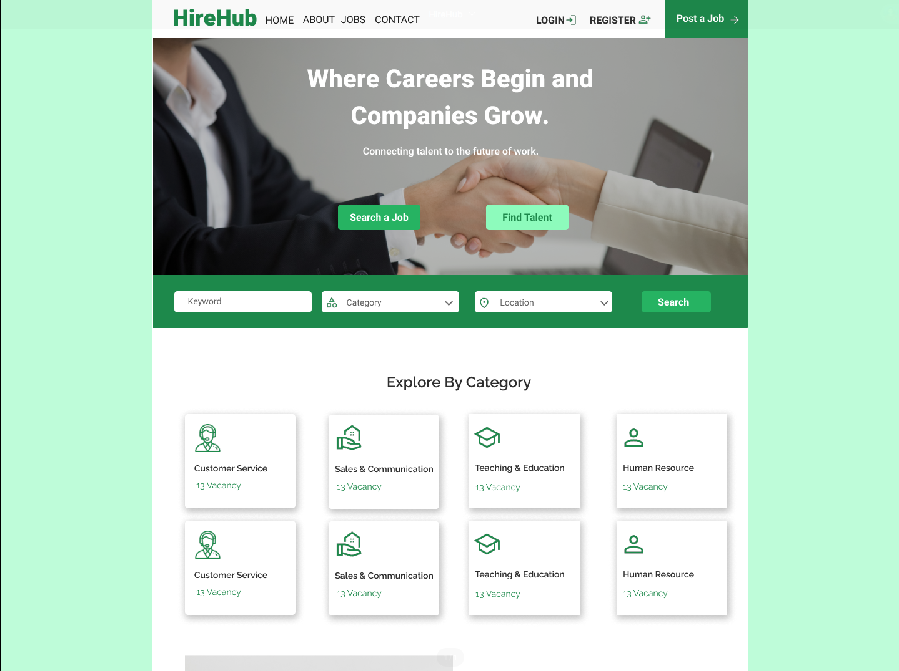
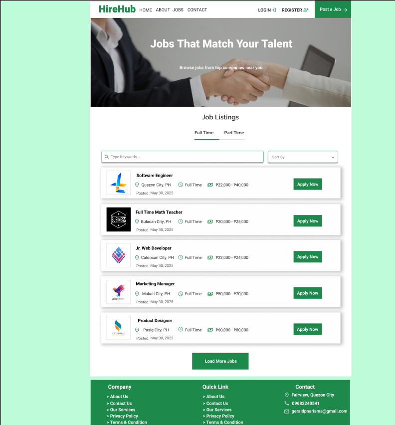
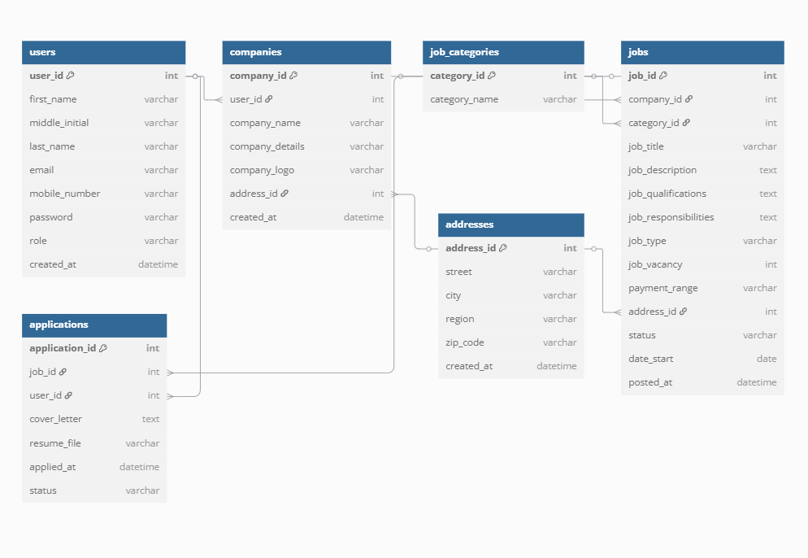

# HireHub - Technical Specification Document

**Version:** 1.0  
**Date:** May 30, 2025  
**Author(s):** Gerald Narisma

---

## Table of Contents

1. [Introduction](#introduction)
2. [Overall Description](#overall-description)
3. [Visual Mockup Reference](#visual-mockup-reference)
4. [Features](#features)
5. [Functional Requirements](#functional-requirements)
6. [Non-Functional Requirements](#non-functional-requirements)
7. [Data Requirements](#data-requirements)
8. [External Interface Requirements](#external-interface-requirements)
9. [Glossary](#glossary)
10. [Appendices](#appendices)

---

## Introduction

### Purpose

HireHub is a job marketplace platform designed to connect job seekers and employers seamlessly. It facilitates job posting, application submissions with resume uploads, and streamlined communication between employers and candidates.

### Scope

The platform supports user registration and login, company profile management, job posting and searching, application tracking, and resume uploads. The system uses PHP, MySQL, React, HTML, CSS, and Bootstrap technologies.

### Definitions, Acronyms, and Abbreviations

- **PHP:** Hypertext Preprocessor – Server-side scripting language.
- **MySQL:** Open-source relational database management system.
- **React:** JavaScript library for building user interfaces.
- **HTML:** HyperText Markup Language – Web page structure language.
- **CSS:** Cascading Style Sheets – Styling language for web pages.
- **Bootstrap:** Front-end component library for responsive design.
- **CRUD:** Create, Read, Update, Delete – Basic data operations.
- **ERD:** Entity Relationship Diagram – Diagram showing database entities and relationships.

---

## Overall Description

### Product Perspective

HireHub is a standalone web application that offers a centralized job marketplace. Employers can register, create company profiles, post job openings, and manage applications. Job seekers can register, search for jobs, and submit applications with resume uploads.

The front-end is built using React, styled with Bootstrap for responsiveness. The back-end is developed in PHP with MySQL as the database. The system is designed to be scalable and secure, accommodating future enhancements like notifications and messaging.

### Product Functions

- User registration and login for job seekers and employers.
- Employer company profile creation and management.
- Job posting and editing.
- Job search with filters.
- Application submission with resume file upload.
- Application status tracking for both applicants and employers.

### User Classes and Characteristics

- **Job Seekers:** Register and log in to search and apply for jobs.
- **Employers:** Register, manage company profiles, post jobs, and review applications.
- **Admins (optional):** Manage platform users and content (if applicable).

### Operating Environment

- Client: Modern web browsers (Chrome, Firefox, Edge, Safari).
- Server: PHP backend with MySQL database.
- Front-end: React with HTML, CSS, and Bootstrap.

### Assumptions and Dependencies

- Users have internet access and modern browsers.
- Resume uploads are limited to accepted file types (e.g., PDF, DOCX).
- User authentication will be securely managed.

---

## Visual Mockup Reference

- [Figma Design File (if available)](https://www.figma.com/proto/JfL6dWe5bBsKAxDL4TyCYC/HireHub?node-id=0-1&t=gVhzeqPPE3ydf9bQ-1)
- Landing Page: Mockup 1
  
- Sample Job Listing Page: Mockup 2
  
- Sample Login Page: Mockup 3
  

---

## Features

- **User Registration and Login:** Secure sign-up and login for job seekers and employers.
- **Company Profile Management:** Employers can add and edit company details and logos.
- **Job Posting:** Employers can create, update, and close job postings.
- **Job Search:** Job seekers can search jobs by category, location, and type.
- **Application Submission:** Users upload resumes and submit job applications.
- **Application Status Tracking:** Both parties can track application progress (pending, reviewed, hired, rejected).
- **Responsive Design:** Fully functional on desktop and mobile devices.
- **Role-Based Access:** Different access and features for job seekers, employers, and admins.

---

## Functional Requirements

### Use Case 1: User Registration

- **Title:** Register new user (job seeker or employer)
- **Description:** Users create an account with name, email, password, and role selection.
- **Actors:** Job seeker, Employer
- **Preconditions:** User is on registration page.
- **Postconditions:** Account is created, user is logged in.
- **Main Flow:**
  1. User enters required information.
  2. User submits form.
  3. System validates data and creates account.
  4. System logs in user and redirects.
- **Alternate Flows:**
  - Invalid input triggers error messages.
  - Duplicate email shows error.

### Use Case 2: Job Posting

- **Title:** Employer posts a job
- **Description:** Employer creates a job listing with details and qualifications.
- **Actors:** Employer
- **Preconditions:** Employer is logged in.
- **Postconditions:** Job is posted and visible in listings.
- **Main Flow:**
  1. Employer fills out job posting form.
  2. Employer submits job.
  3. System saves job and confirms posting.
- **Alternate Flows:**
  - Missing required fields show errors.

### Use Case 3: Job Search and Application

- **Title:** Job seeker searches and applies for jobs
- **Description:** User searches jobs and applies by submitting resume.
- **Actors:** Job Seeker
- **Preconditions:** User is logged in.
- **Postconditions:** Application recorded with resume.
- **Main Flow:**
  1. User searches jobs with filters.
  2. User selects job and uploads resume.
  3. User submits application.
  4. System records application and confirms.
- **Alternate Flows:**
  - Resume file type or size invalid triggers error.

---

## Non-Functional Requirements

### Security

- Use HTTPS for all data transmission.
- Hash user passwords securely with bcrypt or similar.
- Validate and sanitize all user inputs to prevent SQL injection and XSS.
- Restrict file upload types and sizes for resumes.

### Performance

- The system should handle concurrent users efficiently.
- Page load times should be optimized under 3 seconds.

### Scalability

- The architecture supports future growth including messaging, notifications, and analytics.

---

## Data Requirements

### Data Models

- Users: first name, middle initial, last name, email, password, role, mobile number, timestamps.
- Companies: linked to users, company details, logos, locations.
- Jobs: job details, company association, category, status, timestamps.
- Applications: job, user, resume path, status, timestamps.

### Entity Relationship Diagram (ERD)

- ERD
  

---

## External Interface Requirements

### Web Interface

- Accessible via modern browsers on desktop and mobile.
- Responsive UI built with React and Bootstrap.

---

## Glossary

- **CRUD:** Create, Read, Update, Delete operations.
- **ERD:** Entity Relationship Diagram.
- **HTTPS:** Secure HTTP communication.
- **React:** JavaScript UI library.
- **PHP:** Server-side scripting language.
- **MySQL:** Relational database system.

---

## Appendices

- Appendix A: ER Diagram
- Appendix B: API Endpoints (if applicable)
- Appendix C: Use Case Diagrams
- Appendix D: UI Flowcharts

---
